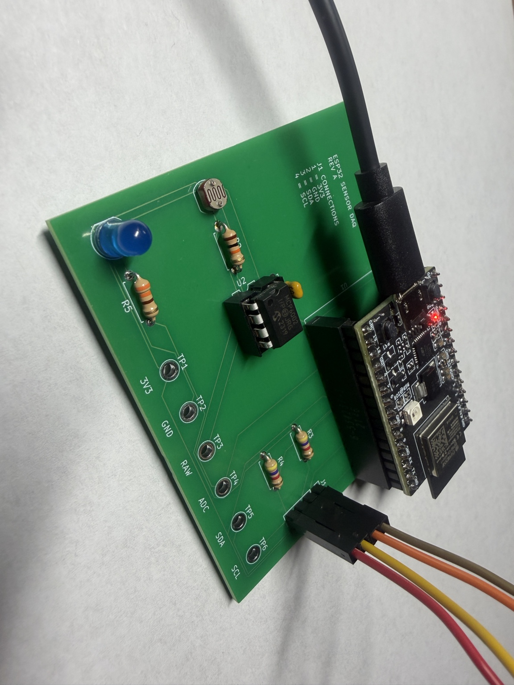
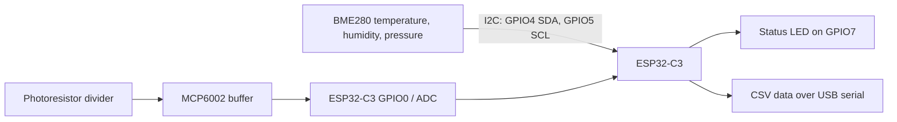
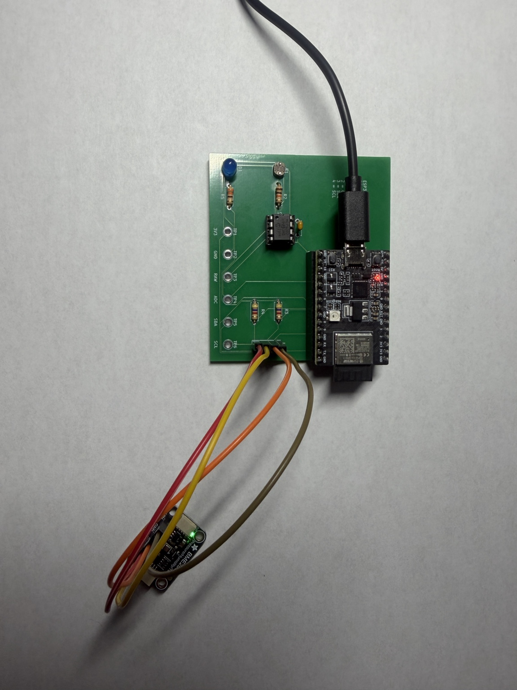

# ESP32 Sensor Data Acquisition Board

A custom two-layer PCB and Arduino firmware project for collecting ambient-light, temperature, humidity, and pressure data with an ESP32-C3.



> **Project status:** Rev A was hand-assembled, programmed, and hardware-validated on 2026-08-22. The ESP32-C3 streams serial CSV data, the BME280 is detected over I2C, and the MCP6002-buffered light channel responds from covered to bright-light conditions. Long-duration logging and calibrated light measurement have not been completed.

## Overview

This project combines a custom KiCad carrier board with an ESP32-C3 DevKitM-1. A photoresistor signal is conditioned by an MCP6002 op-amp and sampled by the ESP32 ADC, while a BME280 breakout provides environmental data over I2C. Six labeled test points expose the primary power and signal nets for structured bring-up and debugging.



## Finished hardware

The Rev A PCB was assembled by hand with the ESP32-C3 in removable socket headers and the BME280 connected through the labeled J1 I2C header.



## Key features

- ESP32-C3 DevKitM-1 controller on removable 1x15 sockets
- BME280 interface with 4.7 kOhm I2C pull-up resistors
- Photoresistor voltage divider buffered by an MCP6002 op-amp
- 100 nF local decoupling capacitor for the analog section
- Status LED with a 330 Ohm current-limiting resistor
- Six labeled test points: 3V3, GND, raw light signal, buffered ADC signal, SDA, and SCL
- CSV serial output suitable for logging or plotting
- Through-hole construction for accessible hand assembly and rework

## Pin map

| Function | ESP32-C3 pin | PCB test point or connector |
|---|---:|---|
| Light sensor ADC | GPIO0 | TP4 `ADC` |
| I2C SDA | GPIO4 | TP5 `SDA`, J1 pin 3 |
| I2C SCL | GPIO5 | TP6 `SCL`, J1 pin 4 |
| Status LED | GPIO7 | D1 through R5 |
| 3.3 V | 3V3 | TP1, J1 pin 1 |
| Ground | GND | TP2, J1 pin 2 |
| Raw light-divider signal | - | TP3 `RAW` |

## Firmware

The Arduino firmware:

1. Initializes the ESP32 ADC and the BME280 at address `0x77`, then tries `0x76` as a fallback.
2. Samples the buffered light-sensor signal once per second.
3. Reads temperature, humidity, and pressure when the BME280 is available.
4. Emits one CSV row per second at 115200 baud.

Measured Rev A serial output:

```text
BME280 detected
time_ms,light_raw,light_percent,temperature_C,humidity_percent,pressure_hPa
628,2058,50.3,25.70,47.22,1009.73
```

### Build environment

- Arduino IDE 2.3.10
- `esp32` board package by Espressif Systems 3.3.11
- Board target: `ESP32C3 Dev Module`
- Adafruit BME280 Library 2.3.0 and its installed dependencies

## Rev A hardware validation

These captured values demonstrate end-to-end operation; they are not calibration data.

| Check | Result | Captured evidence |
|---|---|---|
| Post-assembly power-off check | Pass | No 3V3-to-GND short was found. |
| 3.3 V operation | Pass | The assembled board powered and ran from the ESP32-C3 3.3 V rail. |
| Firmware and serial output | Pass | Firmware uploaded successfully and produced one 115200-baud CSV row per second. |
| BME280 I2C sensing | Pass | Serial Monitor reported `BME280 detected`; observed readings were about 25.2-26.0 C, 47-49% RH, and 1009.7-1009.9 hPa. |
| Light channel - covered | Pass | `light_raw` approximately 247-265; `light_percent` approximately 6.0-6.5%. |
| Light channel - room light | Pass | `light_raw` approximately 1887-2134; `light_percent` approximately 46.1-52.1%. |
| Light channel - flashlight | Pass | `light_raw` = 4095; `light_percent` = 100.0%. |
| Status LED | Pass | A brief firmware-driven activity blink was observed. |

`light_percent` is the 12-bit ADC reading normalized to full scale; it is not a calibrated lux measurement. The light tests validate the complete photoresistor-divider, MCP6002-buffer, ADC, firmware, and serial-output path, but do not independently characterize the op-amp transfer function.

See [VALIDATION.md](docs/VALIDATION.md) for the full validation record and [TEST_PLAN.md](docs/TEST_PLAN.md) for the staged bring-up procedure.

## Repository structure

```text
.
├── fabrication/  Final Gerber and drill archive used for PCB ordering
├── firmware/     Arduino sketch folder and firmware source
├── hardware/     KiCad schematic, PCB, and project files
├── images/       KiCad renders and finished Rev A build photos
└── docs/         BOM, validation record, test plan, and resume notes
```

## Design and validation status

- KiCad schematic ERC: 0 errors and 0 warnings
- KiCad PCB Editor DRC: 0 errors; one expected footprint/library mismatch warning after the ESP32 socket-pad customization
- Unrouted connections: 0
- Gerber and drill archive generated; PCB fabrication and delivery complete
- Rev A assembly, soldering, post-assembly short check, firmware upload, and serial output: complete
- BME280 I2C sensing and end-to-end light-channel response: hardware-validated

## Optional follow-on characterization

- Run and archive a one-hour serial logging test
- Measure TP3 (`RAW`) and TP4 (`ADC`) simultaneously to quantify buffer tracking
- Calibrate the light channel against a lux reference if absolute illumination is required

