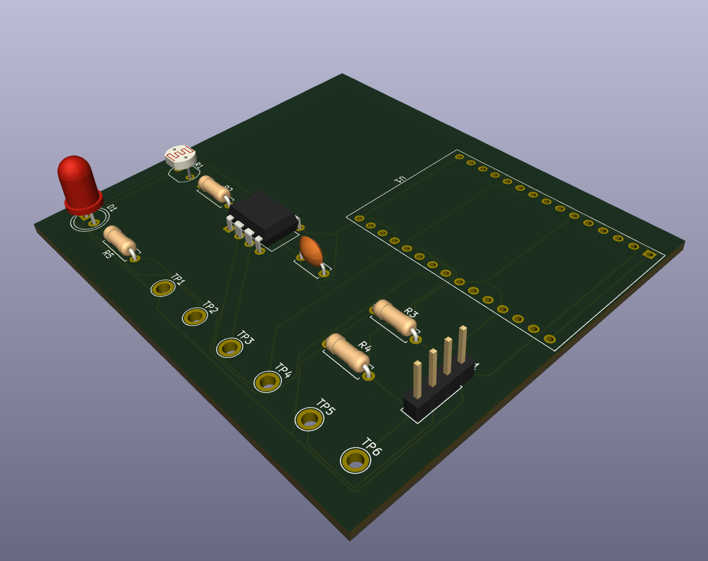
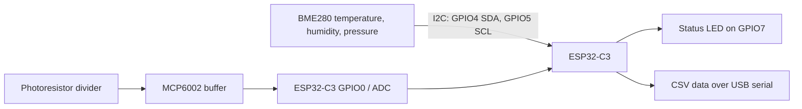

# ESP32 Sensor Data Acquisition Board

A custom two-layer PCB and Arduino firmware project for collecting ambient-light, temperature, humidity, and pressure data with an ESP32-C3.



> **Project status:** PCB design complete and ordered. Firmware compiles successfully for the ESP32-C3. Physical assembly and hardware validation are pending component and PCB arrival.

## Overview

This project combines a custom KiCad carrier board with an ESP32-C3 DevKitM-1. A photoresistor signal is conditioned by an MCP6002 op-amp and sampled by the ESP32 ADC, while a BME280 breakout provides environmental data over I2C. Six labeled test points expose the primary power and signal nets for structured bring-up and debugging.



## Key features

- ESP32-C3 DevKitM-1 controller on removable 1x15 sockets
- BME280 interface with 4.7 kΩ I2C pull-up resistors
- Photoresistor voltage divider buffered by an MCP6002 op-amp
- 100 nF local decoupling capacitor for the analog section
- Status LED with a 330 Ω current-limiting resistor
- Six labeled test points: 3V3, GND, raw light signal, buffered ADC signal, SDA, and SCL
- CSV serial output suitable for logging or plotting
- Through-hole construction for accessible hand assembly and rework

## Pin map

| Function | ESP32-C3 pin | PCB test point or connector |
|---|---:|---|
| Light sensor ADC | GPIO0 | TP4 `ADC` |
| I2C SDA | GPIO4 | TP5 `SDA`, J1 pin 3 |
| I2C SCL | GPIO5 | TP6 `SCL`, J1 pin 4 |
| Status LED | GPIO7 | D1 through R5 |
| 3.3 V | 3V3 | TP1, J1 pin 1 |
| Ground | GND | TP2, J1 pin 2 |
| Raw light-divider signal | — | TP3 `RAW` |

## Firmware

The Arduino firmware:

1. Initializes the ESP32 ADC and the BME280 at address `0x77`, then tries `0x76` as a fallback.
2. Samples the buffered light-sensor signal once per second.
3. Reads temperature, humidity, and pressure when the BME280 is available.
4. Emits one CSV row per second at 115200 baud.

Expected output format (illustrative, not measured hardware data):

```text
time_ms,light_raw,light_percent,temperature_C,humidity_percent,pressure_hPa
1000,2048,50.0,23.41,44.20,1012.63
```

### Build environment

- Arduino IDE 2.3.10
- `esp32` board package by Espressif Systems 3.3.11
- Board target: `ESP32C3 Dev Module`
- Adafruit BME280 Library 2.3.0 and its installed dependencies

## Repository structure

```text
.
├── fabrication/  Final Gerber and drill archive used for PCB ordering
├── firmware/     Arduino sketch folder and firmware source
├── hardware/     KiCad schematic, PCB, and project files
├── images/       KiCad 3D renders
└── docs/         BOM, validation notes, test plan, and resume notes
```

## Design and validation status

- KiCad schematic ERC: 0 errors and 0 warnings
- KiCad PCB Editor DRC: 0 errors; one expected footprint/library mismatch warning after the ESP32 socket-pad customization
- Unrouted connections: 0
- Final Gerber and drill archive generated and accepted for PCB ordering
- Arduino firmware: compile verified
- Physical power-up, sensor response, and end-to-end logging: **pending**

See [VALIDATION.md](docs/VALIDATION.md) for the exact checks completed and [TEST_PLAN.md](docs/TEST_PLAN.md) for the hardware bring-up procedure.

## Next milestones

- Assemble one board while preserving the remaining PCBs as spares
- Verify 3V3-to-GND resistance before applying power
- Power the ESP32-C3 and confirm the 3.3 V rail at TP1
- Upload the firmware and verify serial CSV output
- Validate BME280 readings and light-response behavior
- Capture oscilloscope or multimeter evidence and update this repository with measured results
